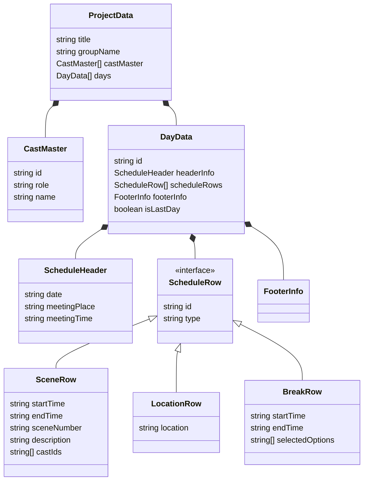

# Kouban プロジェクト アーキテクチャレポート

## 1. 概要
本プロジェクトは、映画や映像制作における「撮影香盤表」を作成・管理するためのWebアプリケーションです。
React (Vite) をフレームワークとして採用し、ブラウザのローカルストレージを利用してデータを永続化しています。

### 技術スタック
- **Framework**: React 19
- **Build Tool**: Vite
- **Language**: TypeScript
- **Styling**: TailwindCSS
- **State Management**: React Hooks (Custom Hooks) + LocalStorage

## 2. ディレクトリ構造
プロジェクトの主要なディレクトリ構成は以下の通りです。

```
src/
├── components/       # UIコンポーネント
│   ├── editor/       # 編集画面用コンポーネント (EditorNew関連)
│   ├── preview/      # プレビュー/印刷画面用コンポーネント (PreviewNew関連)
│   ├── ui/           # 汎用UIコンポーネント (ボタン, フード等)
│   ├── EditorNew.tsx # 編集モードのルートコンポーネント
│   └── PreviewNew.tsx # プレビューモードのルートコンポーネント
├── hooks/            # カスタムフック
│   ├── useProjectData.ts # アプリケーションの全状態管理ロジック
│   └── useLocalStorage.ts # ローカルストレージ操作用フック
├── utils/            # ユーティリティ関数
│   ├── fileUtils.ts  # JSONファイルのimport/export
│   └── timeUtils.ts  # 時間計算ロジック
├── types.ts          # 型定義 (データモデル)
├── App.tsx        # アプリケーションのルートコンポーネント (現在のメイン)
├── main.tsx          # エントリポイント
```

## 3. アプリケーションアーキテクチャ

### 3.1 エントリポイントとルーティング
- **Entry**: `main.tsx` がエントリポイントであり、`App.tsx` をマウントしています。
- **Routing**: 現在、クライアントサイドのルーティングライブラリ（React Router等）は使用されておらず、単一ページアプリケーション（SPA）として構成されています。

### 3.2 データフローと状態管理
アプリケーションの状態管理は、**Container/Presenter パターン** に近い構成を採用しています。

1.  **State Logic (`useProjectData`)**:
    -   `App.tsx` が `useProjectData` フックを使用し、アプリケーション全体のステート（`ProjectData`）と、それを更新する関数群（`updateTitle`, `addSceneRow` 等）を一手に管理します。
    -   データの永続化は `useLocalStorage` を通じて行われ、変更があるたびに自動的にブラウザに保存されます。

2.  **Container (`App`)**:
    -   状態と更新関数を保持し、子コンポーネントである `Editor` と `Preview` にPropsとして分配します。

3.  **Presenters (`EditorNew`, `PreviewNew`)**:
    -   **Editor**: ユーザーからの入力を受け付け、Propsで渡された更新関数を呼び出します。
    -   **Preview**: Propsで渡された `ProjectData` を受け取り、印刷用レイアウトで表示することに専念します。読み取り専用です。

### 3.3 コンポーネント関係図 (Mermaid)

```mermaid
graph TD
    Main[main.tsx] --> App[App.tsx]
    
    subgraph UseHooks [Hooks]
        UsePD[useProjectData]
        UseLS[useLocalStorage]
    end

    subgraph Components [Components]
        Editor[EditorNew.tsx]
        Preview[PreviewNew.tsx]
    end

    App --> UsePD
    UsePD --> UseLS
    
    App -->|State & Update Functions| Editor
    App -->|State (ReadOnly)| Preview

    Editor --> SceneRow[SceneRow Input]
    Editor --> CastList[Cast List Input]
    
    Preview --> ScheduleTable[Schedule Table]
    Preview --> CastTable[Cast Table]
```

## 4. データモデル

データ構造は `types.ts` で定義されており、`ProjectData` をルートとした階層構造を持ちます。

### 4.1 主要エンティティ

- **ProjectData**: アプリケーション全体のデータルート。タイトル、組名、キャストマスタ、および日別データ (`days`) を持ちます。
- **DayData**: 1日分のスケジュールデータ。日付ヘッダー、スケジュール行 (`scheduleRows`)、フッター情報 (`footerInfo`) を持ちます。
- **ScheduleRow**: スケジュールの1行を表します。以下の3タイプが存在します。
    - **SceneRow**: シーン（時間、シーンNo、詳細、キャスト等）
    - **LocationRow**: 場所の変更
    - **BreakRow**: 移動・休憩・食事

### 4.2 データ構造図 (Mermaid)



## 5. まとめ
本プロジェクトは、React Hooksを中心としたシンプルかつ堅牢なアーキテクチャで構築されています。
状態管理ロジック (`useProjectData`) とUI (`Editor`, `Preview`) が明確に分離されており、保守性が高い構造と言えます。
今後の拡張としては、`useProjectData` が肥大化する可能性があるため、機能ごとのカスタムフック分割（`useSceneManager`, `useCastManager` 等）や、Context API / Reducer の導入が検討材料となります。
