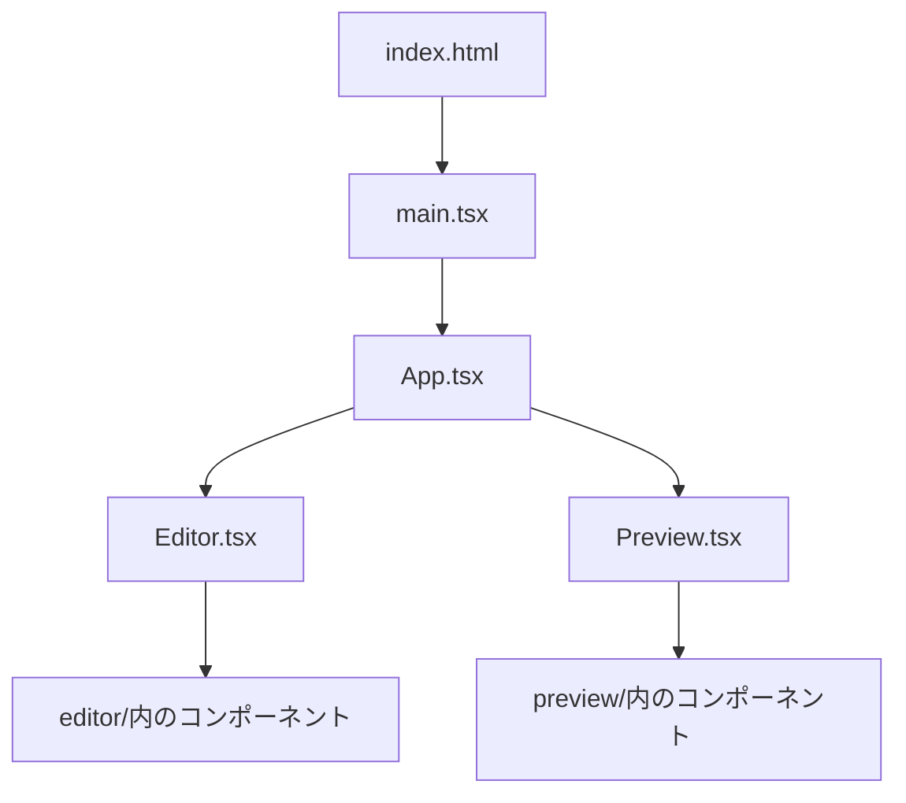

# Kouban プロジェクト構造ガイド

## 概要

このプロジェクトは、**React + TypeScript + Vite** で構成されたモダンなWebアプリケーションです。従来のHTML/CSS/JSとは異なるアプローチでUIを構築しています。

---

## 主要技術スタック

| 技術 | 役割 |
|------|------|
| **React** | UIライブラリ (コンポーネントベースでUIを構築) |
| **TypeScript (.ts, .tsx)** | JavaScriptに型を追加した言語 |
| **Vite** | 開発サーバー＆ビルドツール |
| **TailwindCSS** | ユーティリティファーストのCSSフレームワーク |

---

## ディレクトリ構造

```
Kouban/
├── index.html          ← エントリーポイント（ここから始まる）
├── package.json        ← 依存関係・スクリプト定義
├── vite.config.ts      ← Viteの設定
├── tsconfig.json       ← TypeScriptの設定
│
├── src/                ← ソースコード本体
│   ├── main.tsx        ← Reactアプリの起動点
│   ├── App.tsx         ← メインのAppコンポーネント
│   ├── App.css         ← Appのスタイル
│   ├── index.css       ← グローバルスタイル
│   ├── types.ts        ← 型定義（TypeScriptの型を定義）
│   ├── components/     ← UIコンポーネント群
│   │   ├── Editor.tsx      ← エディター全体
│   │   ├── Preview.tsx     ← プレビュー全体
│   │   ├── editor/         ← エディター関連の小コンポーネント
│   │   ├── preview/        ← プレビュー関連の小コンポーネント
│   │   └── ui/             ← 共通UIコンポーネント
│   ├── hooks/          ← カスタムフック（ロジックの再利用）
│   └── utils/          ← ユーティリティ関数
│
├── dist/               ← ビルド後の静的ファイル（公開用）
├── public/             ← 静的アセット（ファビコン等）
└── Report/             ← ドキュメント
```

---

## 動作の流れ



1. `index.html` がブラウザに読み込まれる
2. `<script src="/src/main.tsx">` で `main.tsx` を実行
3. `main.tsx` が `<App />` コンポーネントをレンダリング
4. `App.tsx` がメインUI（Editor, Preview等）を描画

---

## HTML/CSS/JS との比較

| 従来のHTML/CSS/JS | このプロジェクト (React + TypeScript) |
|-------------------|--------------------------------------|
| HTMLに直接タグを書く | `.tsx`ファイルでJSX（HTML風の構文）を書く |
| CSSファイルで装飾 | TailwindCSSのクラスまたはCSSファイル |
| JSでDOM操作 | Reactのstate/propsでUIを宣言的に更新 |
| 型なし | TypeScriptで型安全 |

---

## 主要ファイルの役割

### `package.json`
- プロジェクトの依存関係（React, Vite等）を管理
- `npm install` でインストール、`npm run dev` で起動

### `tsconfig.json`
- TypeScriptのコンパイル設定

### `vite.config.ts`
- 開発サーバーやビルドの設定

### `src/types.ts`
- アプリ全体で使う型（インターフェース）を定義
- 例: `CastMaster`, `SceneRow`, `ProjectData` など

### `src/App.tsx`
- アプリ全体を統括するメインコンポーネント
- Editor（編集画面）とPreview（プレビュー）を組み合わせる

---

## 編集のポイント

| やりたいこと | 編集するファイル |
|-------------|-----------------|
| UIを変えたい | `src/components/` 内の `.tsx` ファイル |
| データ構造を変えたい | `src/types.ts` |
| メインの流れを変えたい | `src/App.tsx` |
| スタイルを変えたい | `.css` ファイル or TailwindCSSクラス |
| ロジックを再利用したい | `src/hooks/` にカスタムフックを追加 |
| 共通処理を追加したい | `src/utils/` にユーティリティ関数を追加 |

---

## よく使うコマンド

```bash
# 依存関係のインストール
npm install

# 開発サーバー起動（ホットリロード付き）
npm run dev

# 本番用ビルド（dist/に出力）
npm run build

# ビルド結果のプレビュー
npm run preview

# コードのリント（静的解析）
npm run lint
```

---

## TypeScriptの基本

TypeScriptはJavaScriptに「型」を追加した言語です。

```typescript
// 型の定義
interface User {
  name: string;
  age: number;
}

// 型を使う
const user: User = {
  name: "田中",
  age: 30
};
```

`.tsx` ファイルは、TypeScript + JSX（React用のHTML風構文）を組み合わせたファイルです。

```tsx
// Reactコンポーネントの例
function Greeting({ name }: { name: string }) {
  return <h1>こんにちは、{name}さん</h1>;
}
```

---

## 参考リンク

- [React公式](https://react.dev/)
- [TypeScript公式](https://www.typescriptlang.org/)
- [Vite公式](https://vite.dev/)
- [TailwindCSS公式](https://tailwindcss.com/)
